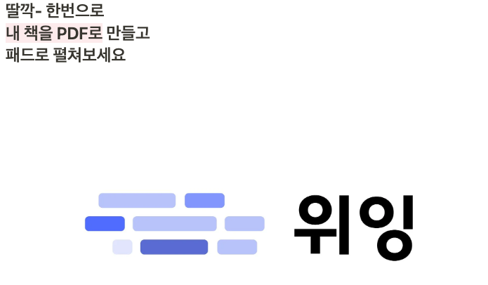
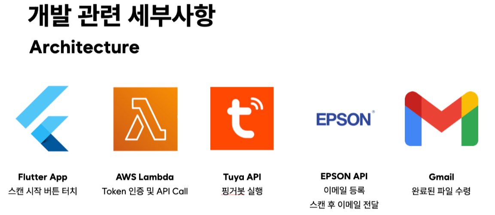
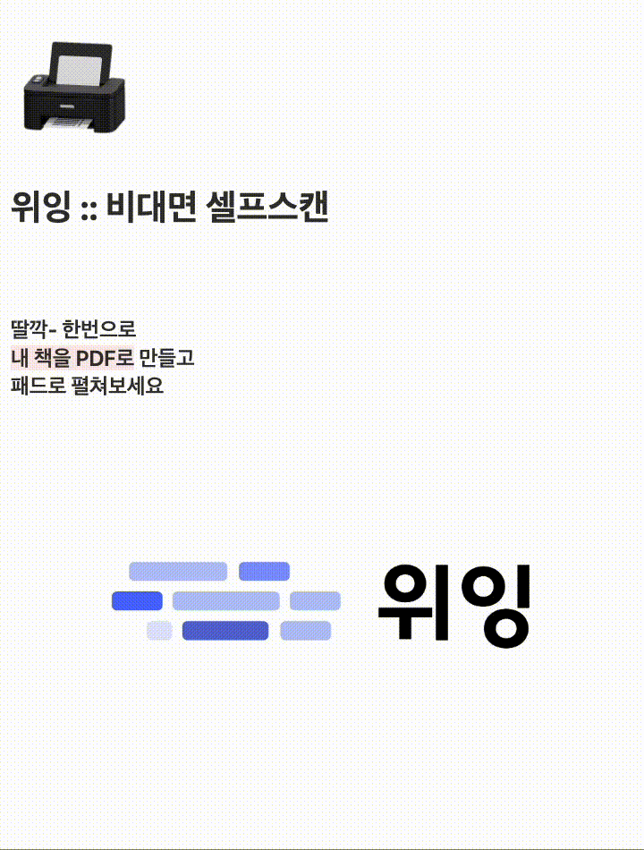

# Weeing[위잉]

- 비대면 셀프 스캔 서비스
 

# Architecture

# Stack
- python, AWS lambda

# Component API
- Fingerbot
  - 스캐너 UI를 자동화하기 위한 컴포넌트
  - 총 3대의 fingerbot을 정해진 순서대로 실행함으로써 스캔닝 작업을 자동화함 
- register_destination
  - 지급받은 복합기에 인증 및 스캔 결과 목적지를 등록하는 API
- register_destination_weeing
  - weeing기획에 맞춘 es-580 epson 스캐너를 사용하는 API
  - 스캔 결과 목적지를 es-580 epson 스캐너에 등록하는 API

# Execution steps
- 모든 API가 AWS Lambda에 배포되어 실행되므로 코드의 형태는 Lambda실행 형식에 맞춤
1. AWS 접속
2. AWS Lambda 생성
3. lambda_function.py에 필요한 라이브러리를 설치
4. 설치한 라이브러리와 함께 lambda_function.py(main함수)를 zip으로 묶어 업로드(배포)
5. AWS API Gateway혹은 Lambda의 Function URL을 사용하여 실행

# Demo Video

